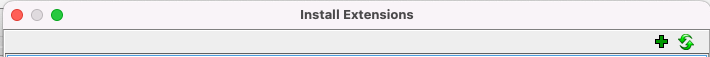

# Installing IRENE from a Release

An IRENE release contains a zip of the Ghidra extensions and a tar file containing a 
docker image for running the decompilation server.

### Installing the Ghidra Plugin

Open `File -> Install extensions` and select the plus button: 


This will open a file browser, find `ghidra_<Ghidra Version>_PUBLIC_<Release Date>_irene-ghidra.zip` and select it.

Hit OK and Ghidra will ask you to restart for the plugin to be loaded. Close ghidra and reopen it with `<path to ghidra>/ghidraRun`.

### Installing the Docker Image

```sh
docker load < <irene-docker-image.tar>
```

IRENE can now be used following the usage instructions in the [usage guide](USAGE.md)