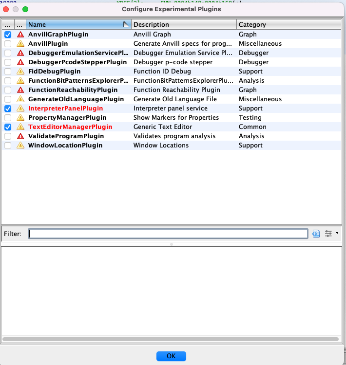

# IRENE Usage Instructions

### Running the server

```sh
docker run -p 50080:50080 irene3:latest \
 /opt/trailofbits/bin/irene3-server -unsafe_stack_locations
```

### Enabling the GUI

If you have not created a project by this point create one with `File -> New Project`

Import a binary by selecting `Import File -> Select Target Binary`.

Open the program and you will be asked to configure new extensions. Select yes and click the blue check mark next to `AnvillGraphPlugin` and hit Ok.

After enabling the GUI there should be a blue checkmark next to `AnvillGraphPlugin`:


If Ghidra does not ask you to configure the plugin you can configure it manually by selections `File -> Configure... -> Experimental -> Configure`

### Patching the Example Binary

To demonstrate IRENE's workflow we have included a simple binary in `../example`

Load the binary into ghidra and open main.

Select the anvill graph icon:


Then select the decompile button:


Unlock the target block:


Change the condition from `call1 != 0` to `call1 == 0` (in this example we want to go to the success case if strcmp == 0) and press the save button.


The plugin will save a c file and json file defining the desired patch.