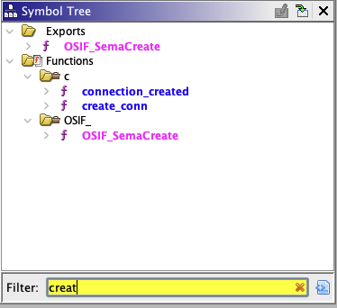
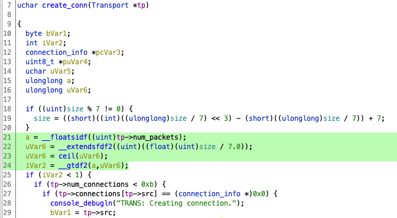
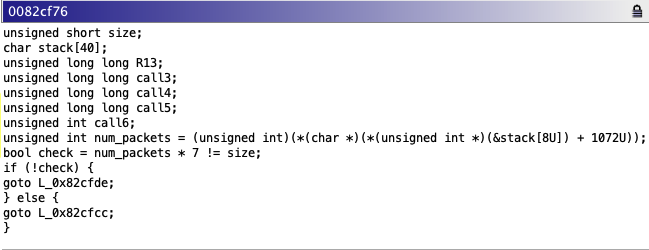

# Challenge 10: MPC5777C

This document serves as a walkthrough for generating a candidate
patch as a solution to Chal 10 on the MPC5777C. The walkthrough assumes the steps in `INSTALL.md` have been completed. The goal is to replace a check of the form `(tp->num_packets > ceil((float)size/7)` with `((tp->num_packets * 7) != size)`.

## Ghidra Setup/Reverse Engineering

IRENE decompiles single functions that the user intends to develop a patch for. This workflow assumes that the user already knows what function they want to patch (`create_conn` in this challenge) and that the user has setup the types of the function and it's callees as would occur in a typical reverse engineering workflow. These function signatures and names can be produced by other teams working on function matching problems (ie. BSI) and imported into the Ghidra database to jump-start this reverse engineering process. 

For the purpose of the walkthough, we have provided a Ghidra database `ppc-vle-program_c.vuln.chal-10.gzf` that can be imported into Ghidra with `File > Import file... > Browse to the .gzf `

After importing and opening the ghidra program you should be able to find `create_conn` in the symbol tree.



Ghidra by default is unable to correctly initialize the R2 and R13 registers which should point to the small data areas according to the PowerPC Embedded ABI. We have provided a Ghidra script that should be run that sets them correctly in order for both the Ghidra analysis and our own analysis to work correctly.

In order to fix these, open the Ghidra script manager:


This will open the script manager window with a `Filter` box. You can find `FixGlobalRegister.java` by entering `FixGlobalRegister` into the filter.

Highlight the script and press the play button to run the script:


After fixing up the `create_conn` function in Ghidra, the decompilation should be similar to:

```c
uchar create_conn(Transport *tp)

{
  byte bVar1;
  int iVar2;
  connection_info *pcVar3;
  uint8_t *puVar4;
  uchar uVar5;
  ulonglong a;
  ulonglong uVar6;
  
  if ((uint)size % 7 != 0) {
    size = ((short)((int)((ulonglong)size / 7) << 3) - (short)((ulonglong)size / 7)) + 7;
  }
  a = __floatsidf((uint)tp->num_packets);
  uVar6 = __extendsfdf2((uint)((float)(uint)size / 7.0));
  uVar6 = ceil(uVar6);
  iVar2 = __gtdf2(a,uVar6);
  if (iVar2 < 1) {
    if (tp->num_connections < 0xb) {
      if (tp->connections[tp->src] == (connection_info *)0x0) {
        console_debugln("TRANS: Creating connection.");
        bVar1 = tp->src;
        pcVar3 = (connection_info *)calloc(1,0xc);
        tp->connections[bVar1] = pcVar3;
        tp->connections[tp->src]->state = TRANSPORT_IDLE;
        tp->connections[tp->src]->data = (uint8_t *)0x0;
      }
      if (tp->connections[tp->src]->data == (uint8_t *)0x0) {
        console_debugln("TRANS: Allocating data space for new connection.");
        pcVar3 = tp->connections[tp->src];
        puVar4 = (uint8_t *)calloc((uint)size,1);
        pcVar3->data = puVar4;
      }
      else {
        console_debugln("TRANS: Re-allocating data space for new connection.");
        pcVar3 = tp->connections[tp->src];
        puVar4 = (uint8_t *)realloc(tp->connections[tp->src]->data,(uint)size);
        pcVar3->data = puVar4;
      }
      tp->num_connections = tp->num_connections + '\x01';
      uVar5 = '\x01';
    }
    else {
      console_println("Max connections taken! Dropping new one.");
      uVar5 = '\0';
    }
  }
  else {
    console_println("RTS mismatch detected!! Connected rejected.");
    uVar5 = '\0';
  }
  return uVar5;
}
```

## Exporting a specification

IRENE consumes a specification of the properties of a function from Ghidra to produce a patcheable version of decompilation that preserves source to binary provenance to the extent required in order to guarentee patch situation.

A spec is produced by running the script `SpecifySingleFunction.java` with the target function selected in Ghidra.

To do this browse to the `create_conn` function and open the Ghidra script manager:


This will open the script manager window with a `Filter` box. You can find `SpecifySingleFunction.java` by entering `SpecifySingleFunction` into the filter.


Highlight the script and press the play button to run the script:


After finishing the script will ask you to select a file name and location to create the specification. Press the `Create` button to create a specification in your selected location.


## Decompiling the Specification

Now that we have a specificaton of the function we intend to patch we need to decompile the patch to a patchset json file with irene-codegen. During `Install.md` we installed a docker image `ghcr.io/trailofbits/irene3/irene3-ubuntu20.04-amd64:0.0.1` for this purpose. 

Navigate to the directory where you saved the spec. Typing `ls` you should see 
```
<specfile>
```
As one of the files in the directory.

You should now be able to run the following (replacing `<specfile>` with the name of your spec):

```
docker run -v $(pwd):/app -it --rm ghcr.io/trailofbits/irene3/irene3-ubuntu20.04-amd64:0.0.1 /opt/trailofbits/bin/irene3-codegen -spec /app/<specfile> -output /app/chal10-ppc-vle-patchset.json -unsafe_stack_locations -add_edges
```

This command mounts your working directory in `/app` of the docker container and runs irene3-codegen on the spec creating a patchset in your current working directory called `chal10-ppc-vle-patchset.json`.

`-add-edges` adds control flow edges to the specification

`-unsafe-stack-locations` splits stack variabels rather than representing the stack as a low level structure (this mode produces better output at the cost of no longer being strictly C compliant).

## Viewing the Basic Block Decompilation and Developing a Patch

Now that decompilation has been produced in `chal10-ppc-vle-patchset.json` this decompilation can be viewed in the Ghidra GUI. In `Install.md` the Ghidra plugin should have been installed and the `AnvillGraphPlugin` enabled.

### Viewing the CFG

Navigate to `create_conn` and open the Anvill graph viewer by selecting the "Display Anvill Graph" button (the left most graph icon with the tooltip):


This will open a new empty graph viewer window.

At the top write select the "Load Patch File Button"


This button will open a filebrowser, select `chal10-ppc-vle-patchset.json` from where it was generated.


This should produce a CFG of C decompilation in the graph view. If the window is still blank make sure to open `create_conn` in the Ghidra listing view.

The graph view navigation is tied to the Ghidra decompiler and listing view, so clicking on a location in the Ghidra decompiler will bring the Anvill Graph view to that location.

We want to patch the the block that contains the following:


Click on the if should bring the Anvill Graph view to the target block to patch 0x82cf76:

Anvill Graph View:


You can also navigate directly to this block by `Navigation -> Goto -> 0x8cf76`

Now we can develop the patch.

### Analysis

Looking at the successor blocks to 0x8cf76:


We can see that 0x82cfcc `console_println` and goes to the function return block, while 0x82cfde is the success case.

We can also notice based on the `call3 = __floatsidf((unsigned int)(*(char *)(*(unsigned int *)(&stack[8U]) + 1072U)));` or through looking at Ghidra that `(unsigned int)(*(char *)(*(unsigned int *)(&stack[8U]) + 1072U))` in this block currently holds the value of `tp->num_packets`. 

We now have enough information to develop a patch canidate.

### Patching

To allow a block to be patched you need to unlock it by pressing the lock icon on the top right:


The lock icon will switch to unlocked and the text for the block will now be editable.

With the knowledge from analysis we can develop a patch for this block.

```c
unsigned short size;
char stack[40];
unsigned long long R13;
unsigned long long call3;
unsigned long long call4;
unsigned long long call5;
unsigned int call6;
unsigned int num_packets = (unsigned int)(*(char *)(*(unsigned int *)(&stack[8U]) + 1072U));
bool check = num_packets * 7 != size;
if (!check) { 
  goto L_0x82cfde;
} else { 
  goto L_0x82cfcc;
}
```



Here we assign the stack variable offset `(unsigned int)(*(char *)(*(unsigned int *)(&stack[8U]) + 1072U));` to `unsigned num_packets` and then use the check `bool check = num_packets * 7 != size;`.
For the if statement, if the check is not true, it should go to the sucess block 0x82cfde, otherwise go to the fail block 0x82cfcc;

### Exporting the Patch Definition

Finally, we can export the patch definition which defines the C semantics, target location, and contextual information about variable storage that TA2 needs to situate this patch. Click the save icon at the top right:


Select a location and name, for instance: `chal10-ppc-vle-patchdef`, if a file already exists the plugin will ask you if it is ok to overwrite it.

Examining the patch file you can see the code, the target location:
```
{
  "patches": [
    {
      "edges": [
        "0x82cfcc",
        "0x82cfde"
      ],
      "patch-addr": "0x82cf76",
      "patch-code": "unsigned short size;\nchar stack[40];\nbool check;\nunsigned long long R13;\nunsigned int num_packets = (unsigned int)(*(char *)(*(unsigned int *)(&stack[8U]) + 1072U));\ncheck = (num_packets * 7) != num_packets;\nR13 = 1073779956ULL;\nif (!check) { \ngoto L_0x82cfde;\n} else { \ngoto L_0x82cfcc;\n}\n",
      "patch-name": "block_8572790",
      "patch-vars": [
        {
          "memory": {
            "frame-pointer": "R1",
            "offset": 0
          },
          "name": "stack"
        },
```

This patch definition can now be passed on to TA2.
