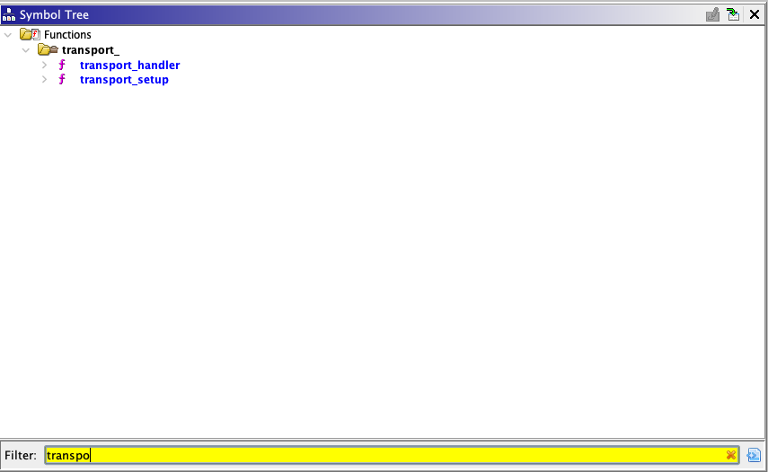
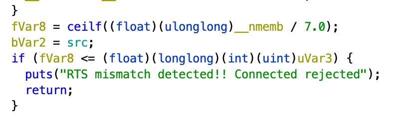
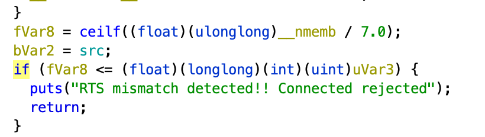
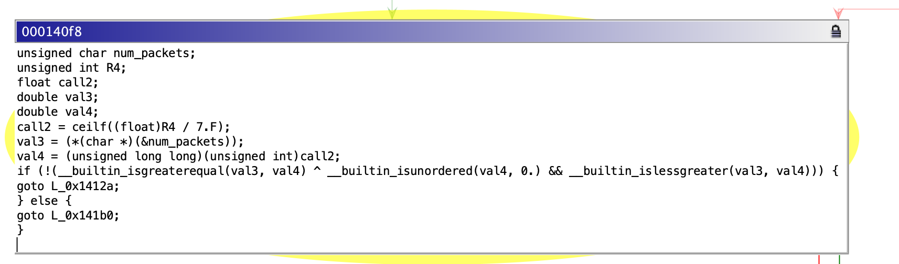
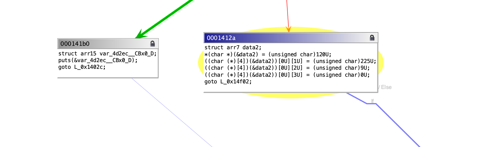
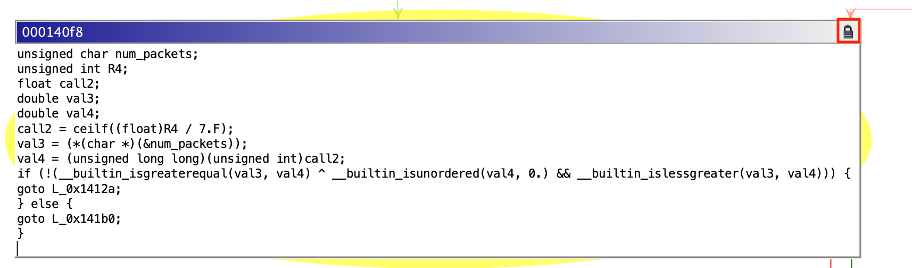
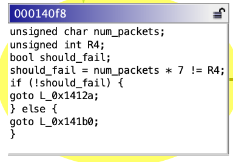

# Challenge 10: Beagle Bone Black

This document serves as a walkthrough for generating a candidate
patch as a solution to Chal 10 on the Beagle Bone. The walkthrough assumes the steps in `INSTALL.md` have been completed. The goal is to replace a check of the form `(num_packets > ceil((float)size/7)` with `((num_packets * 7) != size)`.

## Ghidra Setup/Reverse Engineering

IRENE decompiles single functions that the user intends to develop a patch for. This workflow assumes that the user already knows what function they want to patch (`transport_handler` in this challenge) and that the user has setup the types of the function and it's callees as would occur in a typical reverse engineering workflow. These function signatures and names can be produced by other teams working on function matching problems (ie. BSI) and imported into the Ghidra database to jump-start this reverse engineering process. 

For the purpose of the walkthough, we have provided a Ghidra database `arm-program_c.vuln.chal-10.gzf` that can be imported into Ghidra with `File > Import file... > Browse to the .gzf `

After importing and opening the ghidra program you should be able to find `transport_handler` in the symbol tree.



After clicking on transport handler Ghidra should bring you to the function with decompilation similar to:

```c
void transport_handler(uint32_t can_frame_id,uint8_t can_frame_dlc,uint8_t data1 [4],
                      uint8_t data2 [4],int can_socket_desc,byte current_sa)

{
  int iVar1;
  byte bVar2;
  uint8_t uVar3;
  ssize_t sVar4;
  uchar *puVar5;
  ConnectionInfo *pCVar6;
  uint uVar7;
  uint __nmemb;
  float fVar8;
  ushort local_1f;
  byte bStack29;
  byte bStack28;
  undefined2 local_1b;
  byte local_19;
  
  bStack28 = (byte)data2;
  local_1b = (undefined2)((uint)data2 >> 8);
  local_19 = (byte)((uint)data2 >> 0x18);
  local_1f = (ushort)(data1 >> 8);
  bStack29 = (byte)(data1 >> 0x18);
  src = (byte)can_frame_id;
  if ((can_frame_id << 0x10) >> 0x18 != (uint)current_sa) {
    return;
  }
  if ((can_frame_id & 0xff0000) == 0xeb0000) {
    pCVar6 = connection_infos[can_frame_id & 0xff];
    if (pCVar6 == (ConnectionInfo *)0x0) {
      return;
    }
    if (pCVar6->state != EST) {
      return;
    }
    pCVar6->recv_num_packets = pCVar6->recv_num_packets + '\x01';
    printf("Recieved packet %d from SA %02x\n");
    uVar7 = data1 & 0xff;
    if (uVar7 == 0) {
      return;
    }
    pCVar6 = connection_infos[src];
    if (pCVar6->num_packets < uVar7) {
      puts("Arbit packet location detected! Connected closed");
      FUN_00013fcc();
      return;
    }
    puVar5 = pCVar6->data;
    iVar1 = (uVar7 - 1) * 7;
    *(uint *)(puVar5 + iVar1) = CONCAT13(bStack28,(int3)(data1 >> 8));
    *(undefined2 *)(puVar5 + iVar1 + 4) = local_1b;
    puVar5[iVar1 + 6] = local_19;
    if (pCVar6->recv_num_packets < pCVar6->num_packets) {
      return;
    }
    printf("Recieved all %d packets, closing connection\n");
    FUN_00013fcc();
    return;
  }
  if ((can_frame_id & 0xff0000) != 0xec0000) {
    return;
  }
  if ((data1 & 0xff) != 0x10) {
    if ((data1 & 0xff) != 0xff) {
      return;
    }
    if (connection_infos[can_frame_id & 0xff] == (ConnectionInfo *)0x0) {
      return;
    }
    printf("Recieved Abort from %d\n");
    FUN_00013fcc();
    return;
  }
  __nmemb = (local_1f & 0xff) << 8 | (uint)(local_1f >> 8);
  num_packets = bStack29;
  printf("Recieved RTS from %d to allocate %d bytes of data from %d no. of packets\n",
         can_frame_id & 0xff,__nmemb,(uint)bStack29,can_frame_id,(uint)can_frame_dlc);
  uVar3 = num_packets;
  uVar7 = __nmemb + (__nmemb / 7 + (__nmemb - __nmemb / 7 >> 1) >> 2) * -7 & 0xffff;
  if (uVar7 != 0) {
    __nmemb = (__nmemb + 7) - uVar7 & 0xffff;
  }
  fVar8 = ceilf((float)(ulonglong)__nmemb / 7.0);
  bVar2 = src;
  if (fVar8 <= (float)(longlong)(int)(uint)uVar3) {
    puts("RTS mismatch detected!! Connected rejected");
    return;
  }
  uVar7 = (uint)src;
  if (0x91 < num_connections) {
    return;
  }
  pCVar6 = connection_infos[uVar7];
  if (pCVar6 == (ConnectionInfo *)0x0) {
    pCVar6 = (ConnectionInfo *)calloc(1,0xc);
    connection_infos[uVar7] = pCVar6;
    pCVar6->state = IDLE;
    pCVar6->data = (uchar *)0x0;
  }
  else if (pCVar6->data != (uchar *)0x0) {
    puVar5 = (uchar *)realloc(pCVar6->data,__nmemb);
    pCVar6->data = puVar5;
    goto LAB_00014144;
  }
  puVar5 = (uchar *)calloc(__nmemb,1);
  pCVar6->data = puVar5;
LAB_00014144:
  pCVar6->num_packets = uVar3;
  pCVar6->state = EST;
  num_connections = num_connections + '\x01';
  CTS.data._5_2_ = local_1b;
  CTS.data[7] = local_19;
  CTS.can_id._1_1_ = bVar2;
  CTS.data[1] = bStack28;
  sVar4 = write(can_socket_desc,&CTS,0x10);
  if (sVar4 == 0x10) {
    return;
  }
                    /* WARNING: Subroutine does not return */
  err(1,"could not send CTS");
}
```

## Exporting a specification

IRENE consumes a specification of the properties of a function from Ghidra to produce a patchable version of decompilation that preserves source to binary provenance to the extent required in order to guarantee patch situation.

A spec is produced by running the script `SpecifySingleFunction.java` with the target function selected in Ghidra.

To do this browse to the `transport_handler` function and open the Ghidra script manager:


This will open the script manager window with a `Filter` box. You can find `SpecifySingleFunction.java` by entering `SpecifySingleFunction` into the filter.


Highlight the script and press the play button to run the script:


After finishing the script will ask you to select a file name and location to create the specification. Press the `Create` button to create a specification in your selected location.


## Decompiling the Specification

Now that we have a specification of the function we intend to patch we need to decompile the patch to a patchset json file with irene-codegen. During `Install.md` we installed a docker image `ghcr.io/trailofbits/irene3/irene3-ubuntu20.04-amd64:0.0.1` for this purpose. 

Navigate to the directory where you saved the spec. Typing `ls` you should see 
```
<specfile>
```
As one of the files in the directory.

You should now be able to run the following (replacing `<specfile>` with the name of your spec):

```
docker run -v $(pwd):/app -it --rm ghcr.io/trailofbits/irene3/irene3-ubuntu20.04-amd64:0.0.1 /opt/trailofbits/bin/irene3-codegen -spec /app/<specfile> -output /app/chal10-arm-patchset.json -unsafe_stack_locations -add_edges
```

This command mounts your working directory in `/app` of the docker container and runs irene3-codegen on the spec creating a patchset in your current working directory called `chal10-arm-patchset.json`.

`-add-edges` adds control flow edges to the specification

`-unsafe-stack-locations` splits stack variables rather than representing the stack as a low level structure (this mode produces better output at the cost of no longer being strictly C compliant).

## Viewing the Basic Block Decompilation and Developing a Patch

Now that decompilation has been produced in `chal10-arm-patchset.json` this decompilation can be viewed in the Ghidra GUI. In `Install.md` the Ghidra plugin should have been installed and the `AnvillGraphPlugin` enabled.

### Viewing the CFG

Navigate to `transport_handler` and open the Anvill graph viewer by selecting the "Display Anvill Graph" button (the left most graph icon with the tooltip):


This will open a new empty graph viewer window.

At the top write select the "Load Patch File Button"


This button will open a file browser, select `chal10-arm-patchset.json` from where it was generated.


This should produce a CFG of C decompilation in the graph view. If the window is still blank make sure to open `transport_handler` in the Ghidra listing view.

The graph view navigation is tied to the Ghidra decompiler and listing view, so clicking on a location in the Ghidra decompiler will bring the Anvill Graph view to that location.

We want to patch the if condition that leads to the puts "RTS mismatch":


Click on the if should bring the Anvill Graph view to the target block to patch 0x140f8:

Ghidra Decompiler:


Anvill Graph View:


You can also navigate directly to this block by `Navigation -> Goto -> 0x140f8`

Now we can develop the patch.

### Analysis

Looking at the successor blocks to 0x140f8:


 we can see that 0x141b0 prints the error then goes to function exit, while 0x1412a is the success case.

We can also notice based on the `ceilf((float R4)/7.F);` or through looking at Ghidra that R4 in this block currently holds the value of size. 

We now have enough information to develop a patch candidate.

### Patching

To allow a block to be patched you need to unlock it by pressing the lock icon on the top right:



The lock icon will switch to unlocked and the text for the block will now be editable.

With the knowledge from analysis we can develop a patch for this block.



Since we know that R4 == size should_fail = `num_packets * 7 != R4` then if !should_fail we go to the success block 0x1412a otherwise we go to the fail block 0x141b0.

### Exporting the Patch Definition

Finally, we can export the patch definition which defines the C semantics, target location, and contextual information about variable storage that TA2 needs to situate this patch. Click the save icon at the top right:


Select a location and name, for instance: `chal10-arm-patchdef`, if a file already exists the plugin will ask you if it is ok to overwrite it.

Examining the patch file you can see the code, the target location:
```
{
  "patches": [
    {
      "edges": [
        "0x1412a",
        "0x141b0"
      ],
      "patch-addr": "0x140f8",
      "patch-code": "unsigned char num_packets;\nunsigned int R4;\nbool should_fail;\nshould_fail = num_packets * 7 != R4;\nif (!should_fail) { \ngoto L_0x1412a;\n} else { \ngoto L_0x141b0;\n}\n",
      "patch-name": "block_82168",
      "patch-vars": [
```

As well as live variable definitions, for instance R4 (size) is only live at entry to this block, and not at exit:
```
{
          "at-entry": [
            [
              "register",
              "R4"
            ]
          ],
          "name": "R4"
        }
}
```

This patch definition can now be passed on to TA2.
