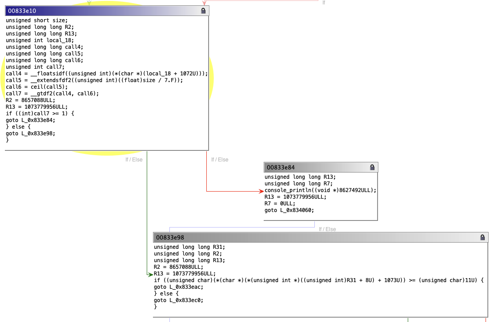
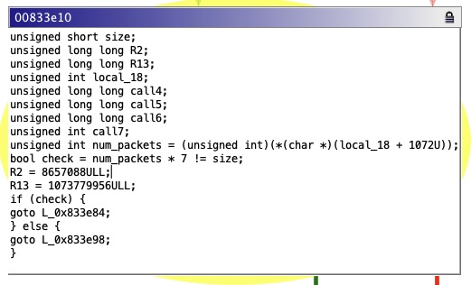

# Challenge 10: MPC5777C - Book E

This document serves as a walkthrough for generating a candidate
patch as a solution to Chal 10 on the MPC5777C. The walkthrough assumes the steps in `INSTALL.md` have been completed. The goal is to replace a check of the form `(tp->num_packets > ceil((float)size/7)` with `((tp->num_packets * 7) != size)`.

## Ghidra Setup/Reverse Engineering

The steps here are identical to the steps outlined in [Chal10VLEppc.md#ghidra-setupreverse-engineering](Chal10VLEppc.md#ghidra-setupreverse-engineering).

## Exporting a specification

The steps here are identical to the steps outlined in [Chal10VLEppc.md#exporting-a-specification](Chal10VLEppc.md#exporting-a-specification).

## Decompiling the Specification

The steps here are identical to the steps outlined in [Chal10VLEppc.md#decompiling-the-specification](Chal10VLEppc.md#decompiling-the-specification).

## Viewing the Basic Block Decompilation and Developing a Patch

Now that decompilation has been produced in `chal10-ppc-patchset.json` this decompilation can be viewed in the Ghidra GUI. In `Install.md` the Ghidra plugin should have been installed and the `AnvillGraphPlugin` enabled.

### Viewing the CFG

Navigate to `create_conn` and open the Anvill graph viewer by selecting the "Display Anvill Graph" button (the left most graph icon with the tooltip):


This will open a new empty graph viewer window.

At the top write select the "Load Patch File Button"


This button will open a filebrowser, select `chal10-ppc-patchset.json` from where it was generated.


This should produce a CFG of C decompilation in the graph view. If the window is still blank make sure to open `create_conn` in the Ghidra listing view.

The graph view navigation is tied to the Ghidra decompiler and listing view, so clicking on a location in the Ghidra decompiler will bring the Anvill Graph view to that location.

We want to patch the the block that contains the following:


Click on the if should bring the Anvill Graph view to the target block to patch 0x833e10:

Anvill Graph View:


You can also navigate directly to this block by `Navigation -> Goto -> 0x833e10`

Now we can develop the patch.

### Analysis

Looking at the successor blocks to 0x833e10:


We can see that 0x833e84 calls `console_println` and goes to the function return block, while 0x833e98 is the success case.

We can also notice based on `call4 = __floatsidf((unsigned int)(*(char *)(local_18 + 1072U)));` and referencing Ghidra decompilation that `(unsigned int)(*(char *)(local_18 + 1072U))` currently holds the value of `tp->num_packets`. 

We now have enough information to develop a patch canidate.

### Patching

To allow a block to be patched you need to unlock it by pressing the lock icon on the top right:


The lock icon will switch to unlocked and the text for the block will now be editable.

With the knowledge from analysis we can develop a patch for this block.

```c
unsigned short size;
unsigned long long R2;
unsigned long long R13;
unsigned int local_18;
unsigned long long call4;
unsigned long long call5;
unsigned long long call6;
unsigned int call7;
unsigned int num_packets = (unsigned int)(*(char *)(local_18 + 1072U));
bool check = num_packets * 7 != size;
R2 = 8657088ULL;
R13 = 1073779956ULL;
if (check) { 
  goto L_0x833e84;
} else { 
  goto L_0x833e98;
}
```



Here we assign the local variable `(unsigned int)(*(char *)(local_18 + 1072U))` to `unsigned num_packets` and then use the check `bool check = num_packets * 7 != size;`.
For the if statement, if the check is true, it should go to the fail block 0x833e84, otherwise go to the success block 0x833e98.

### Exporting the Patch Definition

Finally, we can export the patch definition which defines the C semantics, target location, and contextual information about variable storage that TA2 needs to situate this patch. Click the save icon at the top right:


Select a location and name, for instance: `chal10-ppc-patchdef`, if a file already exists the plugin will ask you if it is ok to overwrite it.

Examining the patch file you can see the code, the target location:
```
{
  "patches": [
    {
      "edges": [
        "0x833e84",
        "0x833e98"
      ],
      "patch-addr": "0x833e10",
      "patch-code": "unsigned short size;\nunsigned long long R2;\nunsigned long long R13;\nunsigned int local_18;\nbool check;\nunsigned int num_packets = (unsigned int)(*(char *)(local_18 + 1072U));\ncheck = (num_packets * 7) != size;\nR2 = 8657088ULL;\nR13 = 1073779956ULL;\nif (check) { \ngoto L_0x833e84;\n} else { \ngoto L_0x833e98;\n}\n",
      "patch-name": "block_8601104",
      "patch-vars": [
```

This patch definition can now be passed on to TA2.
