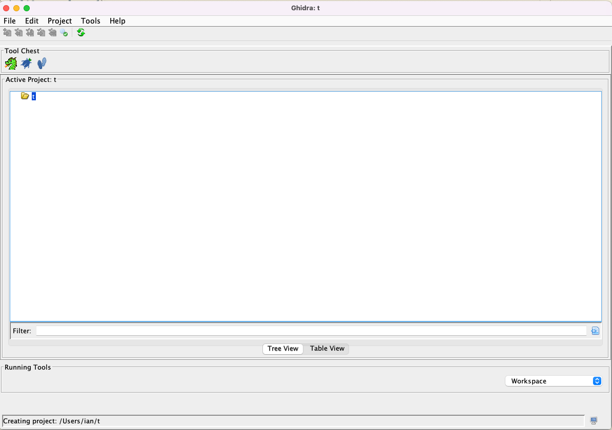
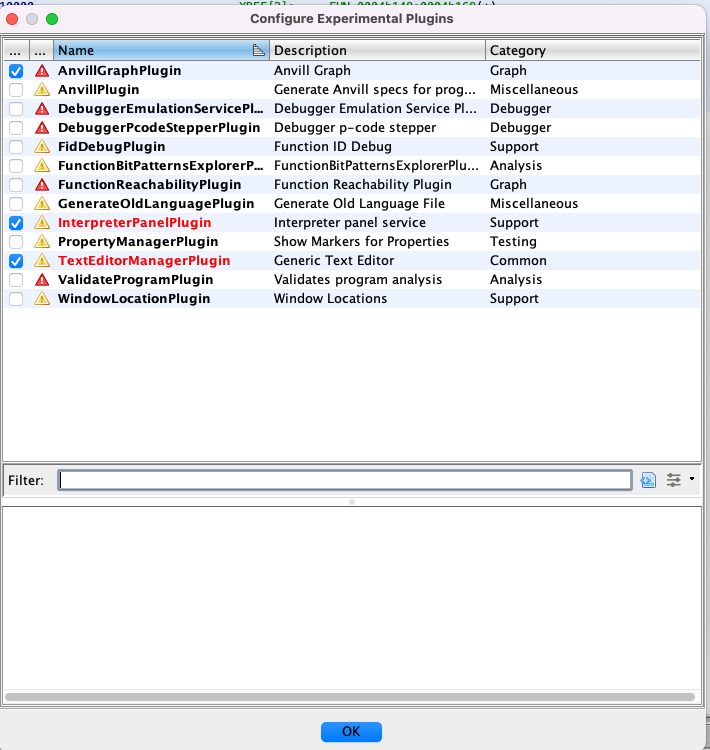

# Installing IRENE

Irene is disributed as two components: a docker image containing the decompiler and a Ghidra plugin that exports function
specifications and the GUI.

The IRENE-3-v0.0.1.zip contains corresponding artifacts:
* `ghidra_10.1.5_PUBLIC_20230224_irene-ghidra.zip` (Our Ghidra plugin)
* `ghidra_10.1.5_PUBLIC_20220726.patched.zip` (Our version of 10.1.5 Ghidra with patches for PPC)
* `irene3-ubuntu20.04-amd64:0.0.1.tar`

The release also contains pre-reverse engineered Ghidra databases for Chal 10 ARM/ PPC/ PPC-vle:
* `chal10-arm.gzf`
* `chal10-ppc.gzf`
* `chal10-ppc-vle.gzf`


## Installing Ghidra

To install Ghidra unpack the `ghidra_10.1.5_PUBLIC_20220726.patched.zip` to a location where you want your Ghidra home to be. 

Run Ghidra by `<path to ghidra>/ghidraRun` which should open a menu to create a new project.

This should leave you at an empty project window:


## Installing the plugin

Open `File -> Install extensions` and select the plus button: 


This will open a file browser, find `ghidra_10.1.5_PUBLIC_20230224_irene-ghidra.zip` and select it.

Hit OK and Ghidra will ask you to restart for the plugin to be loaded. Close ghidra and reopen it with `<path to ghidra>/ghidraRun`.

## Enabling the GUI

If you have not created a project by this point create one with `File -> New Project`

Import the arm challenge by doing `Import File -> Select chal10-arm.gzf`.

Open the program and you will be asked to configure new extensions. Select yes and click the blue check mark next to `AnvillGraphPlugin` and hit Ok.

After enabling the GUI there should be a blue checkmark next to `AnvillGraphPlugin`:


If Ghidra does not ask you to configure the plugin you can configure it manually by selections `File -> Configure... -> Experimental -> Configure`

## Installing the Decompiler

This step assumes you have docker installed. On ubuntu this can be installed with `sudo apt install docker.io`

After installing docker load irene3-ubuntu20.04-amd64:0.0.1.tar with the following command 

`docker load < <path to irene3>/irene3-ubuntu20.04-amd64:0.0.1.tar`

`docker images` should now show:

```
REPOSITORY                                            TAG        
ghcr.io/trailofbits/irene3/irene3-ubuntu20.04-amd64   0.0.1      
```

To ensure that you can run the decompiler test this command:
`docker run -it --rm ghcr.io/trailofbits/irene3/irene3-ubuntu20.04-amd64:0.0.1 /opt/trailofbits/bin/irene3-codegen --help` 

Which should produce:
```
irene3-codegen: IRENE3 codegen

  Flags from /app/bin/Codegen/Main.cpp:
    -add_edges (add outgoing edges to blocks for cfg construction) type: bool
      default: false
    -h (help) type: bool default: false
    -lift_list (list of entities to lift) type: string default: ""
    -output (output patch file) type: string default: ""
    -spec (input spec) type: string default: ""
    -type_propagation (output patch file) type: bool default: false
    -unsafe_stack_locations (create separate locals for each stack location)
      type: bool default: false
```