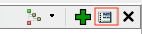
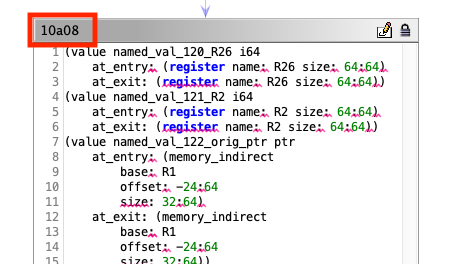
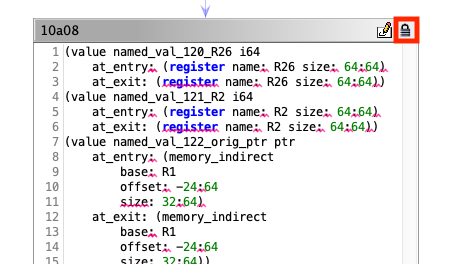
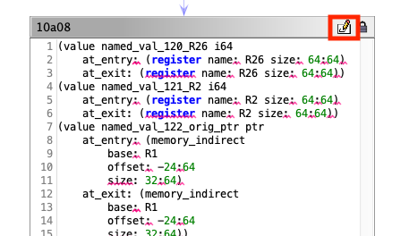

# GUI Patching

IRENE supports a GUI workflow that performs the entire patching process without leaving Ghidra. 

## Preparation

Ensure that the current state of the Ghidra function matches the desired patch. Variables and types you would like to use in the patch should be available in the Ghidra DB. Any [slices](slicing.md) should be added to the slice manager.

Additionally, if there are global symbols that will be referenced in the patch but are not used by the target function, these should be added to the Anvill required symbols window. This can be done by opening the window "Anvill Required Symbols", selecting the green plus button, and adding the string for the desired symbol.

## Lifting the target function

First open the Anvill patch graph:

Then select the decompile button:

## Editing the target block

The graph view is synchronized to the current Ghidra address. The address of the block is at the top of each block: 

If a zero byte block was added there may be multiple blocks for the same address. If the block was inserted before an instruction the zero byte block will precede the original block, otherwise it will follow the original block in the graph.

Once the target block is located it can be unlocked with the unlock button:

The text can now be edited. We recommend working on the patch in a text editor and then copy and pasting the text into the GUI (the GUI will reject text that is not syntactically valid). The patch block is a PatchLang region. For more information on the semantics of the language see the [language reference](../lang_ref/intro.md).

After the edit is complete, reselect the lock button to lock the region. The plugin will ask for a location to save the new PatchLang code to.

## Compiling a block

Now select the compile button in the target block:

This button will open a compilation window with several options

- `Features`: these are optional LLVM cpu features for the compilation target (ie. +thumb_mode for thumb mode)
- `CPU`: the target LLVM cpu (can be left blank if default triplet cpu will work) (ie. cortex-a8, cortex-m7)
- `Backend`: it is recommended to use the ARM, PPC, X86, or X86_64 backend rather than the generic backend.Blank will attempt to use the generic backend.
- `Detour Location`: a hex (prefixed by 0x) or decimal value for a virtual address with free space to place the detour code. If this field is blank, the patch assembler will add a new segment with free space. This strategy does not work on platforms that will not load new segments. In these cases, the user must find free space for the patch.
-`Optimize for size`: enables -Os in the compiler
- `Select Input Binary`: the original binary into which the patch code will be inserted. The selection menu will by default select the binary imported into Ghidra.

After selecting appropriate options, hit `Ok`. After a moment a file selection dialogue will open, select or create a directory to store the result artifacts in. This directory will contain outbin which is the new patched binary as well as intermediate compilation artifacts and logs.

## Debugging
To debug errors/crashes run 
`docker ps` to identify the container ID.

Then run `docker logs <container ID>` to retrieve stderr and stdout logs for the container. The logs in the compiler directory can also be helpful. 
